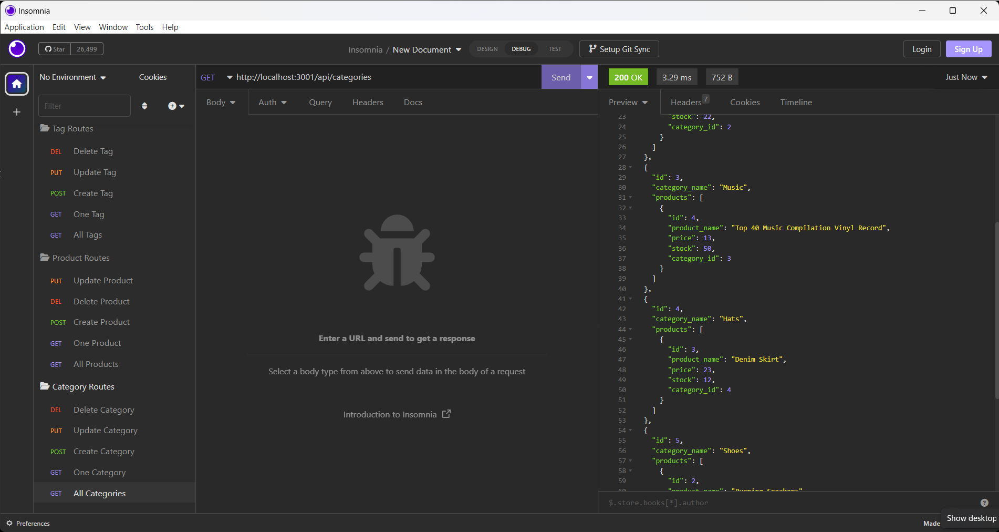

# E-Commerce-ORM

## Description

This e-commerce project is a ORM application developed with MySQL, Sequalize and Express, that allows companies to add, update, retrieve and delete data from the database.

## Installation

You can clone this application from GitHub, add it to your command line and test it on Insomnia.

## Usage

Start the server through the terminal and open it on Insomnia.
Simply navigate through the Categories Products and Tags options to add, update and delete information. 

## Screenshot

## Video Link

https://drive.google.com/file/d/1_LHAMHS8sQNX5ssPZ0XF3xlv7fYaXQEx/view